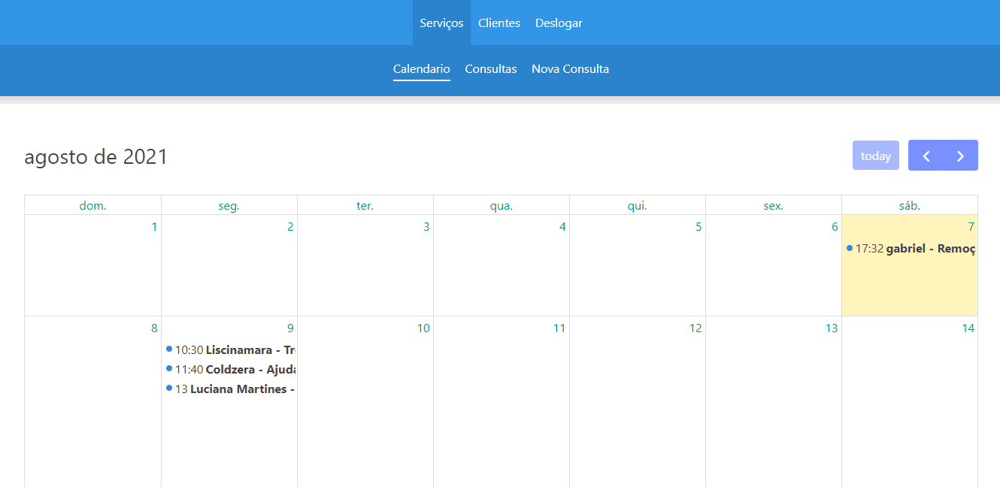
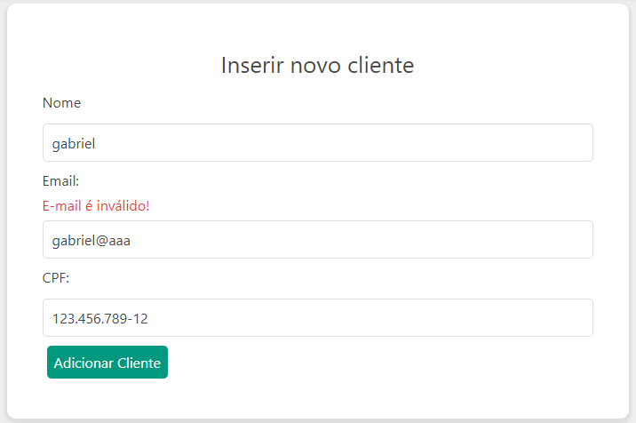
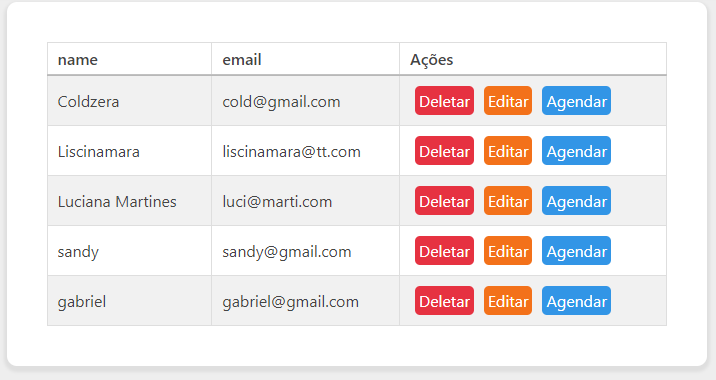
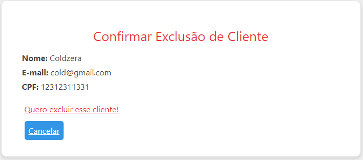
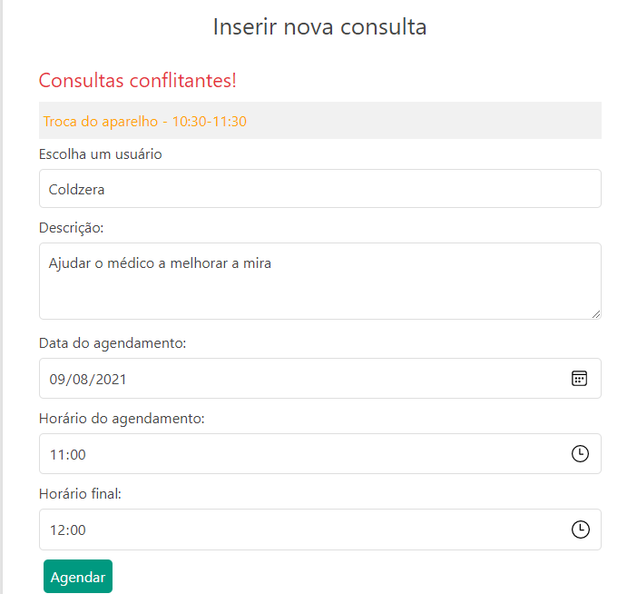
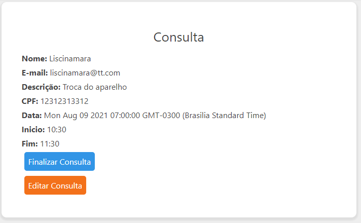
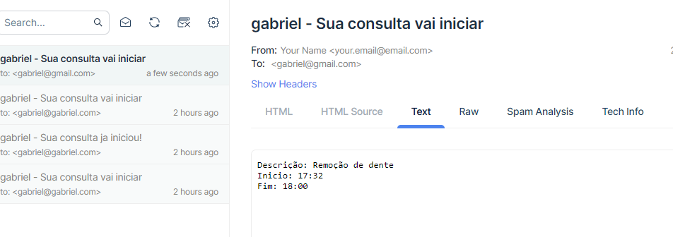
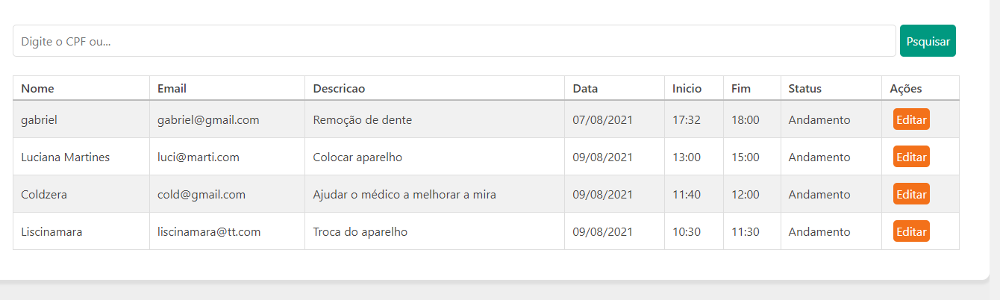

<div align="center">
  
  
  
  
  
  
</div>

<h3 align="center">Sistema de agendamento</h3>     

       

<p align="center">     
Um sistema de agendamento simples.
<br>
</p>

<h3>Informações gerais</h3>


### Introdução   
Este projeto se trata de um pequeno sistema de agendamentos com autenticação, onde um usuário pode fazer agendamento de consultas, pode ver os eventos através de um calendário e além disso, o sistema envia um e-mail aos clientes quando o agendamento está se aproximando.   

Esse sistema ainda está em desenvolvimento e conta com vários bugs, instabilidades e mensagens de erros que serão resolvidas ao longo do tempo.

## Configuração obrigatória
A fim de manter as estatisticas do meu github fiéis a minha codificação, removi os arquivos do FullCalendar da pasta 'public/full', e neste novo repositório você precisa extrair o arquivo 'full.zip' na pasta raiz dentro da pasta public.

## Configurando o MongoDb (Windows 10)
1. Instale o mongodb na sua máquina
2. Configure o Path, provavelmente os binários estarão nesse caminho
```shell
C:\Program Files\MongoDB\Server\5.0\bin
```
3. Abra o prompt de comando como administrador e inicie o serviço do mongodb
```
net start mongodb
```
4. acesse o mongo com o comando:
```shell
mongo
```
5. Estando tudo ok, você pode sair com o comando exit.
6. Para parar o serviço basta rodar o comando abaixo
```shell
net stop mongodb
```

## Configurando o mailtrap
Por enquanto o sistema usa o site mailtrap para simular o envio de e-mail

### Senha do sistema por enquanto
login: admin@admin.com
senha: admin

#### Inserção de cliente com mensagem de erro


#### Listagem de clientes


#### Exclusão de cliente


#### Edição de cliente


#### Inserção de consulta


#### Conflito de consultas


#### Visualização de consulta


#### E-mail enviado a um usuário


#### Listagem de consultas

